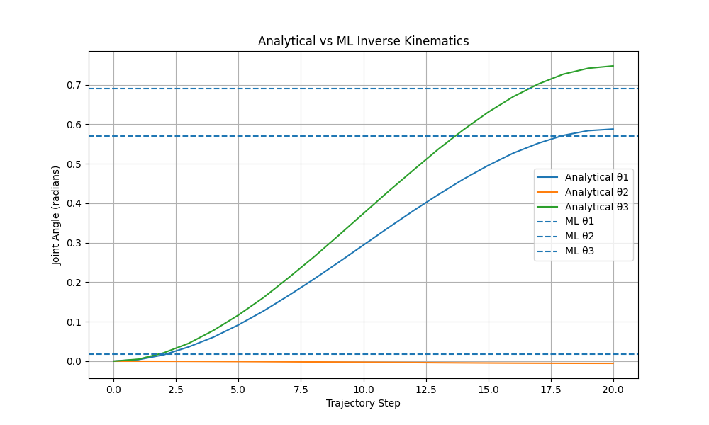

# Robotic Arm Control System – Analytical & ML-Based IK

## Overview
This project implements a complete 3-DOF robotic arm control pipeline in C++ with both traditional analytical inverse kinematics and a machine learning-based solution.

The system includes:
- Forward Kinematics  
- Analytical Inverse Kinematics (multi-solution)  
- Trajectory Planning (smooth motion)  
- Collision Detection  
- Controller Architecture  
- Machine Learning IK (PyTorch → ONNX → C++)  
- Real-time Performance Benchmarking  
- CMake Build System  

---

## Architecture

Target (x, y, z)  
→ Inverse Kinematics  
→ Trajectory Planner  
→ Collision Checking  
→ Controller  
→ Joint Outputs  

---

## Analytical IK
- Closed-form geometric solution  
- Supports elbow-up and elbow-down configurations  
- Validates reachability  
- Execution time: ~20 µs  

---

## Machine Learning IK
- Dataset: 50,000+ samples generated using analytical IK  
- Model: Feed-forward neural network (PyTorch)  
- Exported to ONNX format  
- C++ inference using ONNX Runtime  
- Inference time: ~220 µs  

---

## Performance Comparison

| Method | Average Time |
|------|-------------|
| Analytical IK | ~20.9 µs |
| ML IK | ~156.3 µs |

Both satisfy the real-time requirement (<10 ms).

---

## Project Structure

src/ → C++ implementation
python_ml/ → Dataset generation & training
models/ → ONNX model files
tests/ → Validation executables
build/ → CMake build output


---
## Trajectory Comparison



## Build Instructions

```bash
mkdir build
cd build
cmake ..
cmake --build .

Run:
./robotic_arm
./ml_test
g++ src/kinematics/AnalyticalIK.cpp \
   src/kinematics/ForwardKinematics.cpp \
   tests/ik_test.cpp \
   -o ik_test

./ik_test

Technologies Used:
C++17
PyTorch
ONNX
ONNX Runtime

CMake

